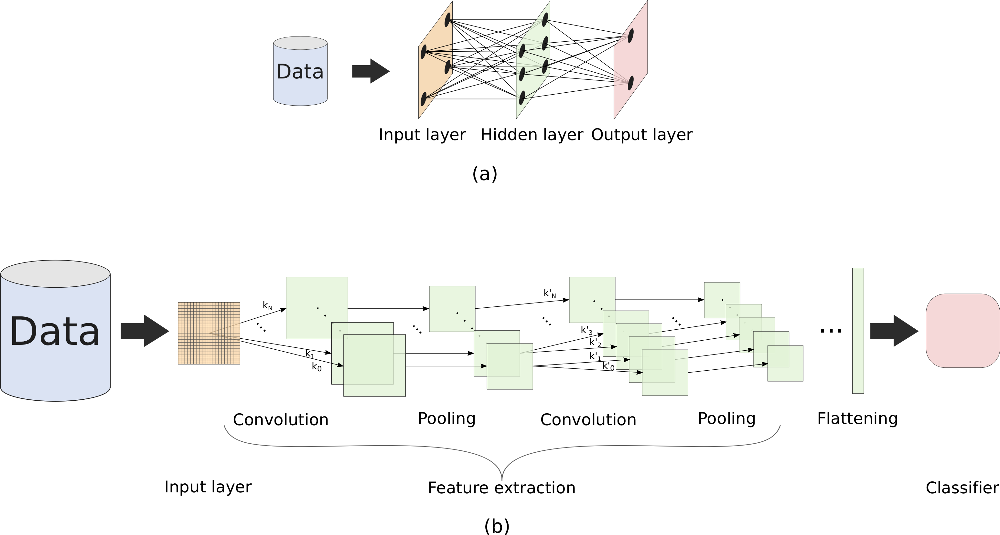

# Deep Learning Tutorial

This tutorial is part of the didactic text: Learning Deep Learning ([CDT-15](https://www.researchgate.net/publication/335798012_Learning_Deep_Learning_CDT-15)), authored by Henrique F. de Arruda, Alexandre Benatti, César Comin, and Luciano da Fontoura Costa.

The purpose of this tutorial is to provide simple didactic examples of deep learning architectures and problem solution. The codes included here are based on toy datasets, and restricted to parameters allowing short processing time. So, these codes are not suitable for other data and/or applications, which will require modifications in the structure and parameters.  These codes have absolutely no warranty.

For all the codes presented here, we use [Keras](https://keras.io/) as the deep learning library. Keras is a useful and straightforward framework, which can be employed for simple and complex tasks.  Keras is written in the Python language, providing self-explanatory codes, with the additional advantage to being executed under [TensorFlow](https://www.tensorflow.org/) backend. We also employ the [Scikit-learn](https://scikit-learn.org/), which is devoted to machine learning. 

More details are available at [CDT-15](https://www.researchgate.net/publication/335798012_Learning_Deep_Learning_CDT-15). 

## Feedforward networks

### Binary Classification
This is the first example of deep learning implementation, in which we address binary classification of wine data. In this example, we consider one feedforward network with 5 hidden layers and with 30 neurons in each layer. The provided networks were built only for a didactic purpose and are not appropriate for real applications.

### Multiclass Classification
In this example, we illustrate a multiclass classification through a wine dataset, in which there are three classes, which were defined according to their regions. We employed the same dataset presented above, but here we considered the three classes. To do so, we use the *softmax* activation function.

## Convolutional Neural Network (CNN)
This tutorial is the second example of deep learning implementation, in which we exemplify a classification task. More specifically, we considered ten classes of colored pictures.

## Long Short-Term Memory (LSTM)

This is the third example of deep learning implementation. Here we use a LSTM network to predict the Bitcoin prices along time by using the input as a temporal series.

## Restricted Boltzmann Machine (RBM)

This is the fourth example of deep learning implementation. Here we use a RMB network to provide a recommendation system of musical instru-ments.

## Autoencoders
This example uses the Autoencoder model to illustrate a possible application. Here we show how to use the resulting codes to reduce the dimentionality. We also project our data by using a Principal Component Analysis(PCA).

## Generative Adversarial Networks (GAN)
This example was elaborated to create a network that can generate handwritten characters automatically.

## Libraries
All of these codes were developed and executed with the environment described in "libraries.txt". 

## Citation Request
If you publish a paper related on this material, please cite:

H. F. de Arruda, A. Benatti, C. H. Comin, L. da F. Costa, "Learning Deep Learning (CDT-15)," 2019.
